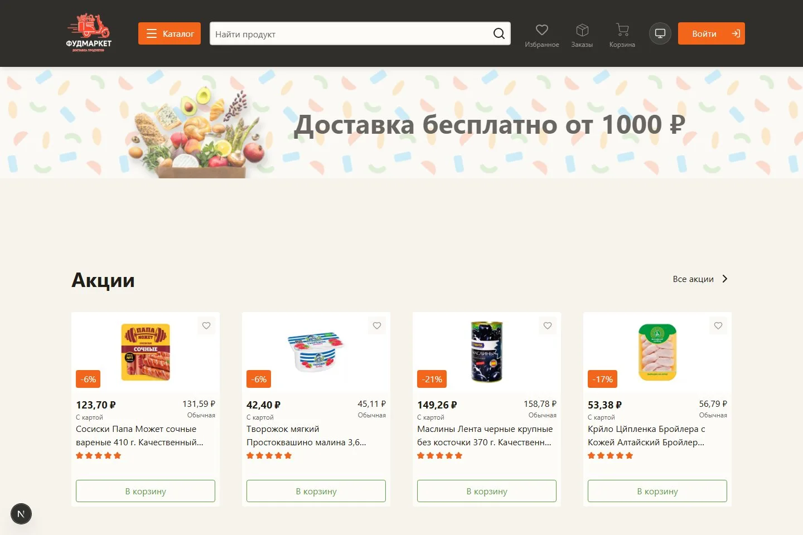
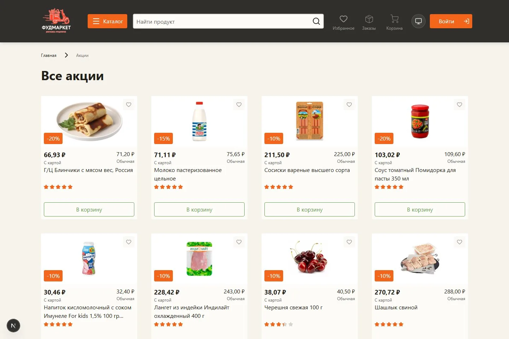
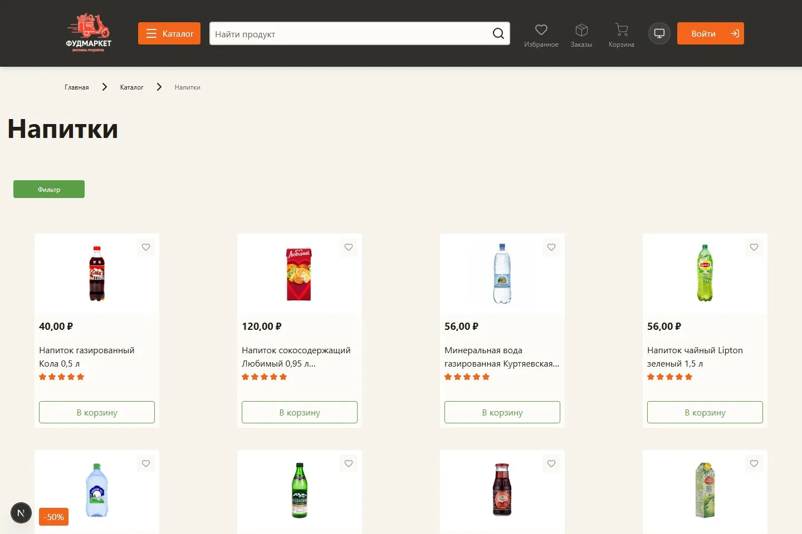
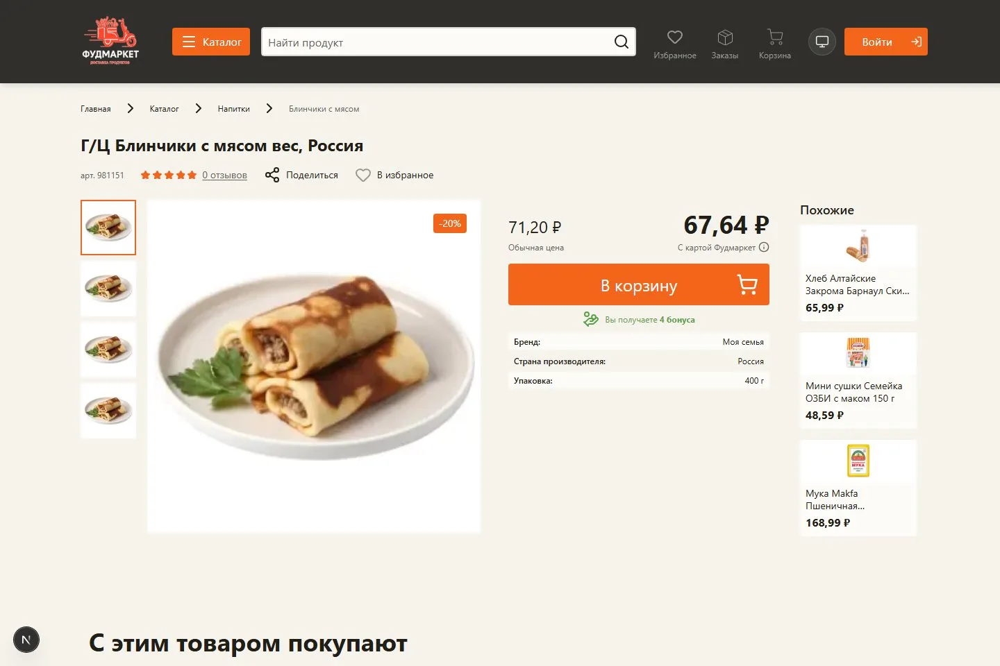
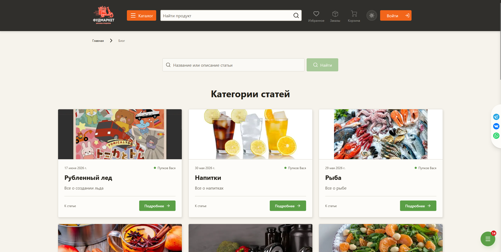

<div align="center">

# 🛒 Delivery Shop

**Платформа доставки еды** — каталог, корзина и заказы, бонусная система, блог с комментариями, CMS и админ-панель.

🌐 Продакшен: **[food-market22.ru](https://food-market22.ru)**

</div>

---

## Доставка без лишних шагов

Delivery Shop - интернет-магазин продуктов с полноценным путём от поиска до доставки. Пользователь выбирает товары, применяет скидки и бонусы, задаёт удобный слот, а команда магазина ведёт заказ до вручения.

<p align="center">
  
</p>

## Каталог

Акции, поиск, фильтры и аккуратные карточки товаров на одной витрине.

<p align="center">
  
  
</p>

## Выбор товара и полезный контент

На странице товара видны цена, скидка, характеристики и подборка похожих позиций. Блог дополняет магазин статьями о продуктах и питании.

<p align="center">
  
  
</p>

## Внутри проекта

- каталог, поиск, избранное, скидки и бонусная программа;
- корзина, выбор времени доставки, повтор заказа и статусы;
- блог с комментариями и CMS для контента;
- панель управления товарами, пользователями, заказами и расписанием.

## Локальный запуск

```bash
git clone <repo-url>
cd delivery-shop
npm install
npm run dev
```

После запуска откройте [http://localhost:3000](http://localhost:3000). Технические детали, переменные окружения и API вынесены в [Documentations.md](Documentations.md) и [INFO_STEK.md](INFO_STEK.md).
